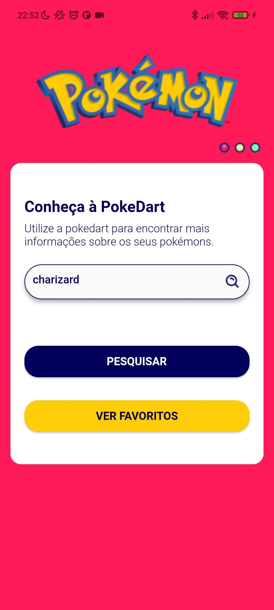
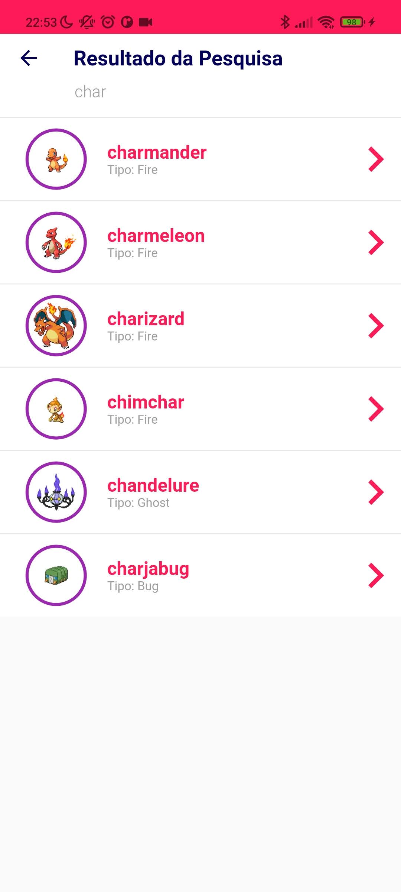
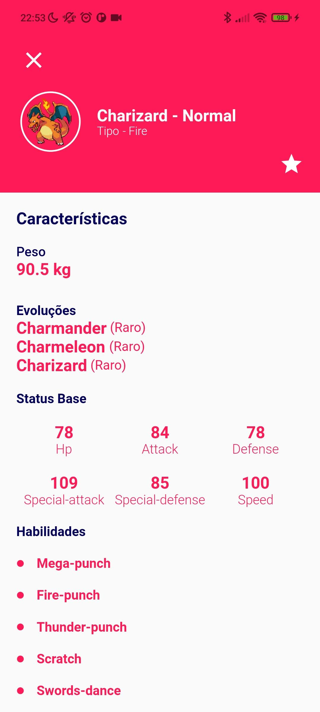
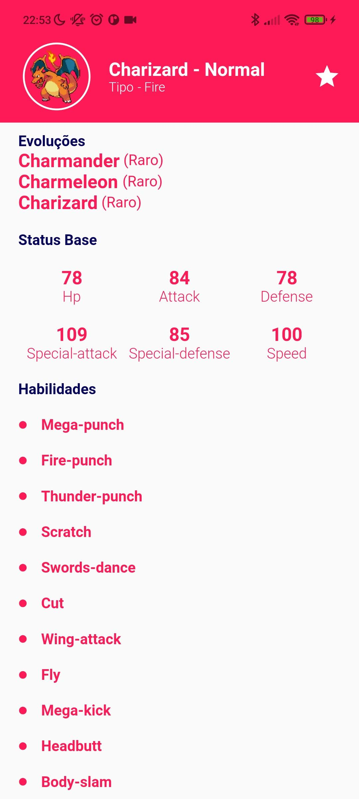
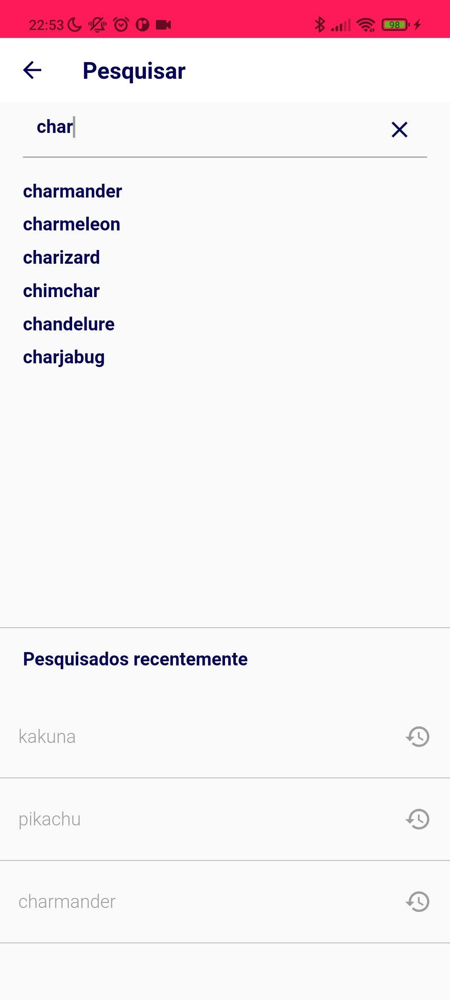
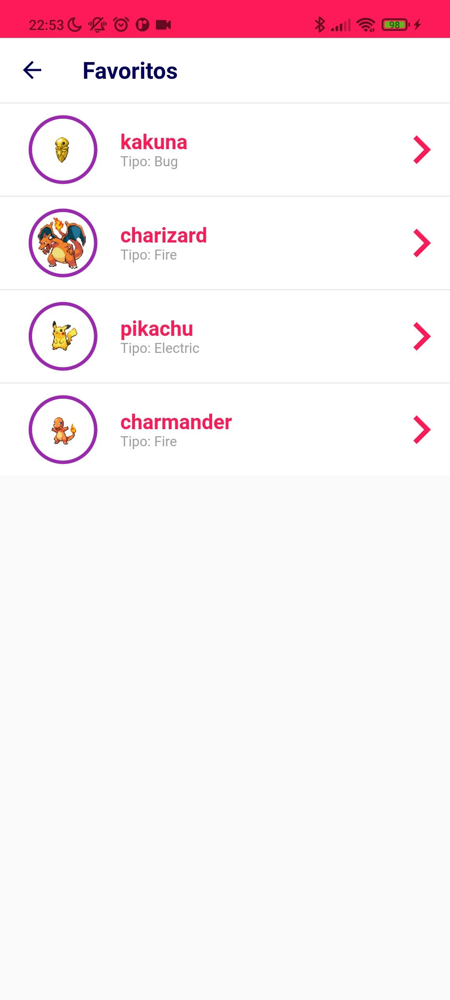

<samp>

# 
PokeDart by Luan Batista

# 
Web, Desktop && Mobile: IOS | Android

## 
Flutter

- ### The PokeDart project was made for a company test, but it is much more than that. In it I learn one more skill, Mobx and I also develop my code in Flutter and Dart! Hope you like it!

## 
Mobile Version: Android | IOS

## 
Web && Desktop

## 
@luanbatistadev

 

<samp>

<h2 align="center">
  Open Source
</h2>

  Copyright © 2022-present, Luan Batista.

PokeDart <a href="/LICENSE">is MIT licensed 💖</a>

</samp>